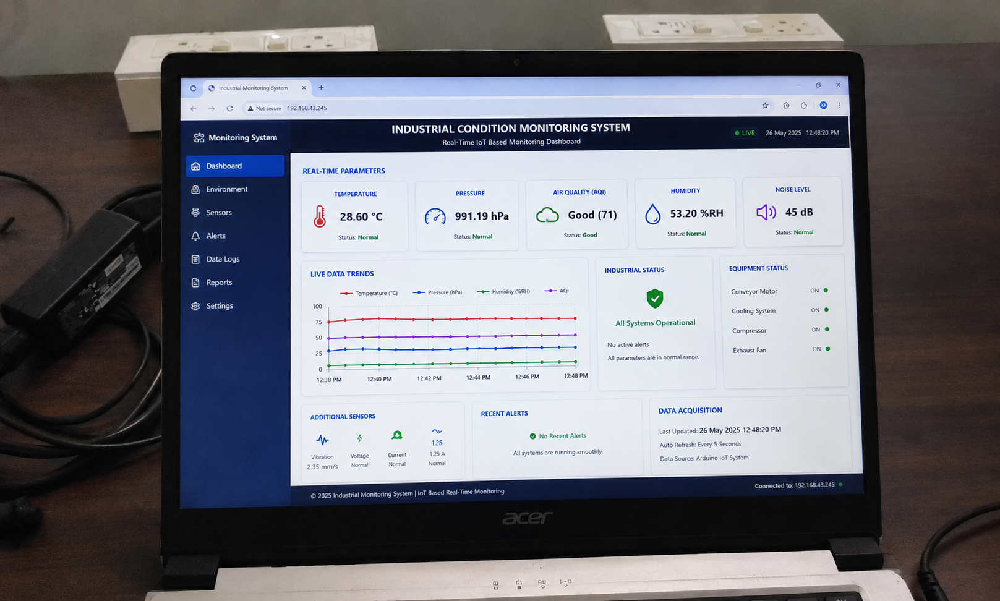

<p align="center">
  
</p>
<h1 align="center">🏭 Industrial Condition Monitoring System</h1>

<h3 align="center">
IoT-Based Real-Time Industrial Environment & Equipment Monitoring Platform
</h3>

<p align="center">
Advanced Embedded IoT Monitoring System for Industrial Automation, Environmental Monitoring, Wireless Data Acquisition, and Live Dashboard Analytics
</p>

<p align="center">


</p>

---

# 📌 Introduction

The **Industrial Condition Monitoring System** is an advanced IoT-enabled industrial monitoring platform developed for intelligent real-time monitoring of industrial environmental and operational parameters.

The system integrates embedded hardware, multi-sensor acquisition, wireless IoT communication, and live dashboard analytics to provide continuous industrial condition monitoring and visualization.

This platform is capable of monitoring:

- Temperature
- Humidity
- Air Quality Index (AQI)
- Atmospheric Pressure
- Rain Detection
- Wind Speed

Sensor data is acquired using **Arduino UNO** and transmitted wirelessly through the **ESP8266 Wi-Fi module** to a modern real-time industrial monitoring dashboard.

The project demonstrates practical implementation of:

- Industrial IoT
- Embedded Systems
- Sensor Interfacing
- Wireless Communication
- Real-Time Monitoring
- Industrial Automation Concepts
- Environmental Monitoring Systems

---

# 🚀 Key Features

- Real-Time Industrial Monitoring
- IoT-Based Wireless Communication
- Multi-Sensor Integration
- Live Dashboard Analytics
- Real-Time Graph Visualization
- Environmental Monitoring
- Industrial Status Monitoring
- Equipment Monitoring Interface
- Expandable Embedded Architecture
- Industrial Data Acquisition
- Smart Monitoring Dashboard
- Wireless Sensor Communication

---

# 🧠 System Architecture

<p align="center">
  
</p>

```text
Industrial Sensors
        ↓
Arduino UNO
        ↓
ESP8266 Wi-Fi Module
        ↓
Web Dashboard
        ↓
Real-Time Industrial Monitoring
```

---

# 🔌 Practical Circuit Connection Diagram

<p align="center">
  
</p>

---

# ⚙ Hardware Components

| Component | Description |
|---|---|
| Arduino UNO | Main Embedded Controller |
| ESP8266 | IoT Wi-Fi Communication Module |
| DHT22 | Temperature & Humidity Sensor |
| BMP280 | Pressure Sensor |
| MQ135 | Air Quality Sensor |
| Rain Sensor Module | Rain Detection |
| Anemometer | Wind Speed Sensor |
| Breadboard | Circuit Prototyping |
| 5V Regulated Supply | System Power Supply |

---

# 💻 Software Technologies Used

| Technology | Purpose |
|---|---|
| Arduino IDE | Embedded Programming |
| HTML5 | Dashboard Structure |
| CSS3 | Dashboard Styling |
| JavaScript | Dynamic Dashboard Interaction |
| Chart.js | Real-Time Data Visualization |

---

# 📡 Sensors & Monitoring Parameters

| Sensor | Parameter Monitored | Function |
|---|---|---|
| DHT22 | Temperature & Humidity | Environmental Monitoring |
| BMP280 | Atmospheric Pressure | Pressure Analysis |
| MQ135 | Air Quality Index | AQI & Gas Detection |
| Rain Sensor | Rain Detection | Weather Monitoring |
| Anemometer | Wind Speed | Air Flow Monitoring |
| ESP8266 | Wireless Communication | IoT Connectivity |

---

# 🖥 Dashboard Output

<p align="center">
  
</p>

---

# 🎥 Project Demonstration

<p align="center">
  <video src="demo_video.mp4" width="90%" controls></video>
</p>

---

# ⚙ Working Principle

1. Industrial sensors continuously collect environmental and operational data.
2. Arduino UNO processes the acquired sensor values.
3. ESP8266 transmits the processed data wirelessly.
4. The dashboard receives live industrial data.
5. Sensor values are visualized through:
   - Real-time parameter cards
   - Live graphical trends
   - Equipment monitoring panels
   - Industrial status sections
6. Users can remotely monitor industrial conditions in real time.

---

# 📊 Dashboard Functionalities

## ✔ Real-Time Sensor Monitoring
Displays continuously updating industrial sensor values.

## ✔ Live Data Visualization
Real-time graphical representation of industrial parameter variations.

## ✔ Equipment Monitoring
Displays operational status of industrial equipment.

## ✔ Industrial Status Interface
Shows operational condition of the monitoring platform.

## ✔ Alert Monitoring
Supports abnormal condition indication and monitoring.

## ✔ Data Acquisition Monitoring
Tracks communication and sensor update intervals.

---

# 🌐 IoT Communication

The project uses the ESP8266 Wi-Fi module for wireless communication between the embedded monitoring system and the web dashboard.

The IoT communication layer enables:

- Real-time monitoring
- Remote industrial access
- Wireless sensor communication
- Live dashboard updates
- Expandable cloud integration capability

---

# 📂 Repository Contents

```text
Circuit Connection.png
Circuit.png
Industrial monitoring block diagram.png
Industrial-monitoring-Arduino-code.ino
Practical circuit connections (2).png
README.md
dashboard_output.png
demo_video.mp4
index.html
project_banner.png
```

---

# ▶ Installation & Setup

## 🔹 Hardware Setup

1. Connect all sensors according to the circuit diagram.
2. Connect ESP8266 with Arduino UNO.
3. Provide regulated 5V power supply.
4. Verify all sensor connections carefully.

---

## 🔹 Arduino Setup

1. Install Arduino IDE
2. Install required libraries
3. Open Arduino code
4. Select Arduino UNO board
5. Upload the code to Arduino

---

# 📚 Required Arduino Libraries

```text
DHT Sensor Library
Adafruit BMP280 Library
Adafruit Unified Sensor Library
Wire Library
SoftwareSerial Library
```

---

## 🔹 Dashboard Setup

1. Open the project folder
2. Run `index.html`
3. Connect ESP8266 to the same network
4. Start monitoring industrial parameters in real time

---

# 📈 Industrial Applications

- Industrial Environment Monitoring
- Smart Factory Systems
- Industrial Automation
- Predictive Maintenance
- Environmental Monitoring
- Industrial IoT Systems
- Safety Monitoring
- Smart Manufacturing
- Process Monitoring

---

# 🔥 Technical Highlights

- Embedded System Design
- IoT-Based Monitoring
- Wireless Communication
- Sensor Interfacing
- Real-Time Data Acquisition
- Industrial Dashboard Development
- Environmental Monitoring
- Industrial Automation Concepts
- Data Visualization Systems

---

# 🧪 Learning Outcomes

This project provides practical exposure to:

- Industrial IoT Systems
- Embedded Programming
- Sensor Interfacing
- Wireless Communication
- Dashboard Development
- Environmental Monitoring
- Real-Time Monitoring Systems
- Industrial Automation Fundamentals

---

# 📈 Future Enhancements

- Cloud Integration
- AI-Based Fault Detection
- Mobile Application Support
- MQTT Communication
- PLC & SCADA Integration
- Smart Alert System
- Data Logging & Analytics
- Predictive Maintenance Algorithms
- Secure Remote Monitoring

---

# 🛡 Advantages

- Real-Time Monitoring
- Wireless Data Communication
- Low-Cost Implementation
- Scalable Architecture
- Multi-Sensor Support
- Smart Industrial Monitoring
- Easy System Expansion
- Modern Dashboard Visualization

---

# 🎯 Project Objectives

- Develop an IoT-based industrial monitoring platform.
- Monitor environmental parameters in real time.
- Implement wireless industrial data acquisition.
- Visualize industrial data through live dashboards.
- Improve industrial monitoring efficiency.
- Demonstrate Industrial IoT applications using embedded systems.

---

# 👨‍💻 Developer

## Paluru Poojesh  
Electrical and Electronics Engineering (EEE)

Industrial IoT & Smart Monitoring Research Project

📧 Email: palurupoojesh@gmail.com

---

# 📜 License

This project is developed for:

- Educational Purposes
- Research & Learning
- Industrial IoT Demonstration

---

# ⭐ GitHub Support

If you found this project useful, consider giving this repository a ⭐ to support the project and future developments.

---
